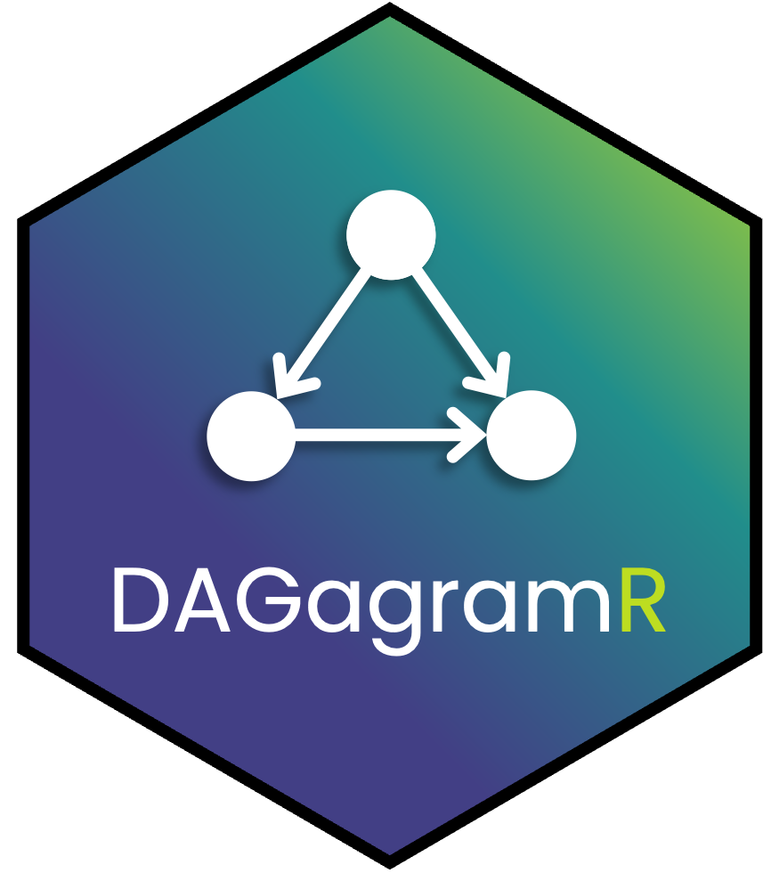

# DAGagramR

{width=10%}

Shiny app to visualize and edit DAGs jointly developed by CCS and DataThink. 

## Purpose
This application enables users to visualize and analyze causal relationships between variables using Directed Acyclic Graphs (DAGs). It specifically focuses on illustrating the effects of various factors on a treatment variable (x) and an outcome variable (y), aiding in understanding causal pathways and potential confounders.

## App Set Up
To run the app in dev mode use the following actions.

1. Clone this repo to your device.
2. Open the project in R studio.
3. Open the app.R file
4. click the 'Run App' button in the top right corner

## To Use
Once the app is running name the treatment and response, this will show in the tool and the DAG will be ready to be edited. Add nodes with the Add Nodes button. While viewing the current nodes, edit their connections (parents and children) and whether they are measured or unmeasured. Once your relationships are in place you can check for open back door paths and condition on nodes to eliminate these paths. 

## Current Limitations/ Bugs
- Removing all connections for a node in edit mode will crash the app.
- Can name the treatment and response the same name and it will crash the app.
